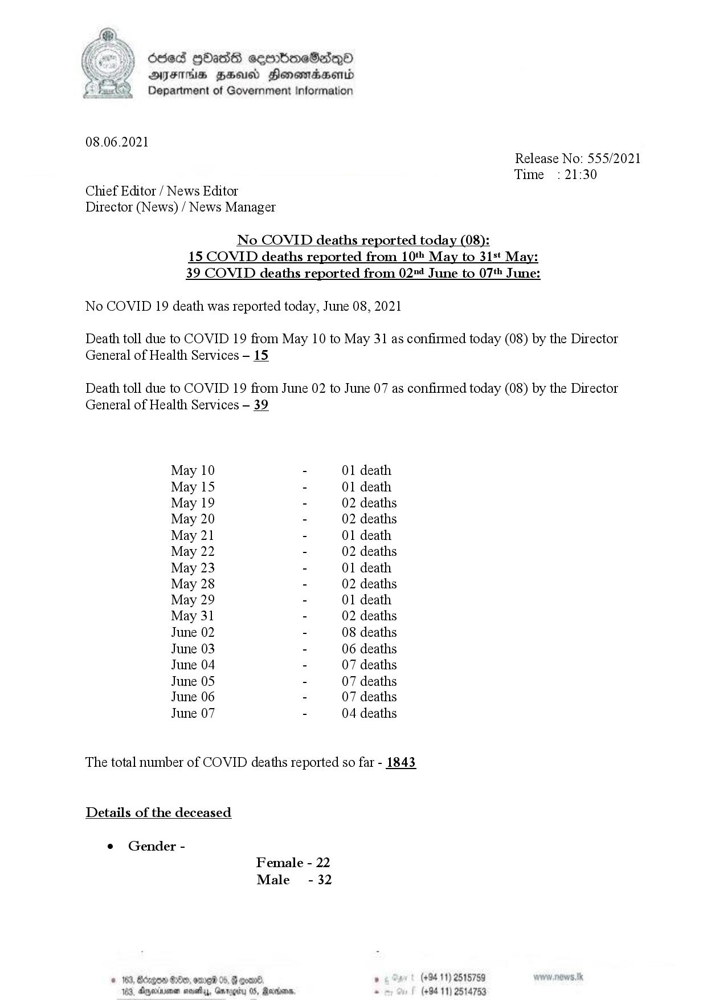
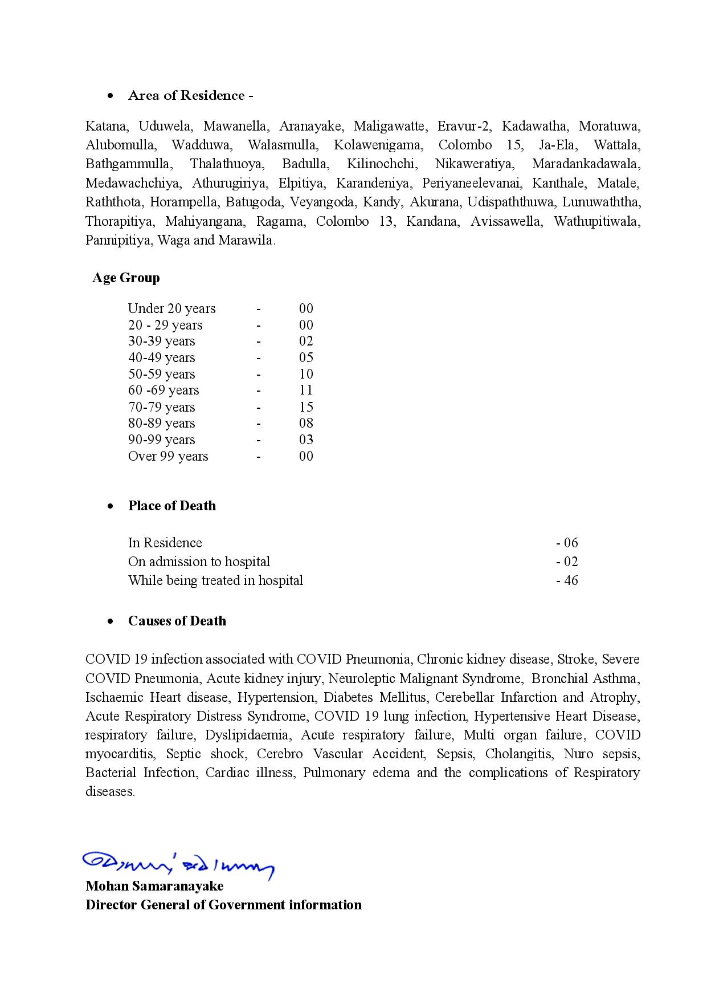

# Press Release No. 555
*2021-06-08 21:30*
## Statistics
* Total Deaths: 1843
### Deaths by Day
* 2021-05-10: 1
* 2021-05-15: 1
* 2021-05-19: 2
* 2021-05-20: 2
* 2021-05-21: 1
* 2021-05-22: 2
* 2021-05-23: 1
* 2021-05-28: 2
* 2021-05-29: 1
* 2021-05-31: 2
* 2021-06-02: 8
* 2021-06-03: 6
* 2021-06-04: 7
* 2021-06-05: 7
* 2021-06-06: 7
* 2021-06-07: 4
### Deaths by Gender
* Female: 22
* Male: 32
### Deaths by Age Group
* 0 to 20: 0
* 20 to 29: 0
* 30 to 39: 2
* 40 to 49: 5
* 50 to 59: 10
* 60 to 69: 11
* 70 to 79: 15
* 80 to 89: 8
* 90 to 99: 3
* 99 to 130: 0
### Deaths by Place
* In Residence : 6
* On admission to hospital : 2
* While being treated in hospital : 46
### Area of Residence of Fatalities
* Akurana
* Alubomulla
* Aranayake
* Athurugiriya
* Avissawella
* Badulla
* Bathgammulla
* Batugoda
* Colombo 13
* Colombo 15
* Elpitiya
* Eravur-2
* Horampella
* Ja-Ela
* Kadawatha
* Kandana
* Kandy
* Kanthale
* Karandeniya
* Katana
* Kilinochchi
* Kolawenigama
* Lunuwaththa
* Mahiyangana
* Maligawatte
* Maradankadawala
* Matale
* Mawanella
* Medawachchiya
* Moratuwa
* Nikaweratiya
* Pannipitiya
* Periyaneelevanai
* Ragama
* Raththota
* Thalathuoya
* Thorapitiya
* Udispaththuwa
* Uduwela
* Veyangoda
* Wadduwa
* Waga and Marawila.
* Walasmulla
* Wathupitiwala
* Wattala
### Cause of Death
* Acute Respiratory Distress Syndrome
* Acute kidney injury
* Acute respiratory failure
* Bacterial Infection
* Bronchial Asthma
* COVID 19 infection associated with COVID Pneumonia
* COVID 19 lung infection
* COVIDmyocarditis
* Cardiac illness
* Cerebellar Infarction and Atrophy
* Cerebro Vascular Accident
* Cholangitis
* Chronic kidney disease
* Diabetes Mellitus
* Dyslipidaemia
* Hypertension
* Hypertensive Heart Disease
* Ischaemic Heart disease
* Multi organ failure
* Neuroleptic Malignant Syndrome
* Nuro sepsis
* Pulmonary edema and the complications of Respiratorydiseases.
* Sepsis
* Septic shock
* SevereCOVID Pneumonia
* Stroke
* tespiratory failure


No COVID deaths reported today (08):
15 COVID deaths reported from 10 May to 31st May:
39 COVID deaths reported from 024 June to 07! June:
No COVID 19 death was reported today, June 08, 2021
Death toll due to COVID 19 from May 10 to May 31 as confirmed today (08) by the Director
General of Health Services - 15.
Death toll due to COVID 19 from June 02 to June 07 as confirmed today (08) by the Director
General of Health Services — 39.
S2ywww, vd)

## Appendix: Structured Information
```json
{
  "ref_no": "555",
  "unixtime": 1623187800,
  "datetime": "2021-06-08 21:30",
  "cum_deaths": 1843,
  "deaths_by_day": [
    {
      "unixtime": 1620604800,
      "date": "2021-05-10",
      "deaths": 1
    },
    {
      "unixtime": 1621036800,
      "date": "2021-05-15",
      "deaths": 1
    },
    {
      "unixtime": 1621382400,
      "date": "2021-05-19",
      "deaths": 2
    },
    {
      "unixtime": 1621468800,
      "date": "2021-05-20",
      "deaths": 2
    },
    {
      "unixtime": 1621555200,
      "date": "2021-05-21",
      "deaths": 1
    },
    {
      "unixtime": 1621641600,
      "date": "2021-05-22",
      "deaths": 2
    },
    {
      "unixtime": 1621728000,
      "date": "2021-05-23",
      "deaths": 1
    },
    {
      "unixtime": 1622160000,
      "date": "2021-05-28",
      "deaths": 2
    },
    {
      "unixtime": 1622246400,
      "date": "2021-05-29",
      "deaths": 1
    },
    {
      "unixtime": 1622419200,
      "date": "2021-05-31",
      "deaths": 2
    },
    {
      "unixtime": 1622592000,
      "date": "2021-06-02",
      "deaths": 8
    },
    {
      "unixtime": 1622678400,
      "date": "2021-06-03",
      "deaths": 6
    },
    {
      "unixtime": 1622764800,
      "date": "2021-06-04",
      "deaths": 7
    },
    {
      "unixtime": 1622851200,
      "date": "2021-06-05",
      "deaths": 7
    },
    {
      "unixtime": 1622937600,
      "date": "2021-06-06",
      "deaths": 7
    },
    {
      "unixtime": 1623024000,
      "date": "2021-06-07",
      "deaths": 4
    }
  ],
  "deaths_by_gender": [
    {
      "gender": "Female",
      "deaths": 22
    },
    {
      "gender": "Male",
      "deaths": 32
    }
  ],
  "deaths_by_age": [
    {
      "age_range": [
        0,
        20
      ],
      "deaths": 0
    },
    {
      "age_range": [
        20,
        29
      ],
      "deaths": 0
    },
    {
      "age_range": [
        30,
        39
      ],
      "deaths": 2
    },
    {
      "age_range": [
        40,
        49
      ],
      "deaths": 5
    },
    {
      "age_range": [
        50,
        59
      ],
      "deaths": 10
    },
    {
      "age_range": [
        60,
        69
      ],
      "deaths": 11
    },
    {
      "age_range": [
        70,
        79
      ],
      "deaths": 15
    },
    {
      "age_range": [
        80,
        89
      ],
      "deaths": 8
    },
    {
      "age_range": [
        90,
        99
      ],
      "deaths": 3
    },
    {
      "age_range": [
        99,
        130
      ],
      "deaths": 0
    }
  ],
  "deaths_py_place": [
    {
      "place": "In Residence ",
      "deaths": 6
    },
    {
      "place": "On admission to hospital ",
      "deaths": 2
    },
    {
      "place": "While being treated in hospital ",
      "deaths": 46
    }
  ],
  "areas_of_residence": [
    "Akurana",
    "Alubomulla",
    "Aranayake",
    "Athurugiriya",
    "Avissawella",
    "Badulla",
    "Bathgammulla",
    "Batugoda",
    "Colombo 13",
    "Colombo 15",
    "Elpitiya",
    "Eravur-2",
    "Horampella",
    "Ja-Ela",
    "Kadawatha",
    "Kandana",
    "Kandy",
    "Kanthale",
    "Karandeniya",
    "Katana",
    "Kilinochchi",
    "Kolawenigama",
    "Lunuwaththa",
    "Mahiyangana",
    "Maligawatte",
    "Maradankadawala",
    "Matale",
    "Mawanella",
    "Medawachchiya",
    "Moratuwa",
    "Nikaweratiya",
    "Pannipitiya",
    "Periyaneelevanai",
    "Ragama",
    "Raththota",
    "Thalathuoya",
    "Thorapitiya",
    "Udispaththuwa",
    "Uduwela",
    "Veyangoda",
    "Wadduwa",
    "Waga and Marawila.",
    "Walasmulla",
    "Wathupitiwala",
    "Wattala"
  ],
  "causes_of_death_lines": [
    "Acute Respiratory Distress Syndrome",
    "Acute kidney injury",
    "Acute respiratory failure",
    "Bacterial Infection",
    "Bronchial Asthma",
    "COVID 19 infection associated with COVID Pneumonia",
    "COVID 19 lung infection",
    "COVIDmyocarditis",
    "Cardiac illness",
    "Cerebellar Infarction and Atrophy",
    "Cerebro Vascular Accident",
    "Cholangitis",
    "Chronic kidney disease",
    "Diabetes Mellitus",
    "Dyslipidaemia",
    "Hypertension",
    "Hypertensive Heart Disease",
    "Ischaemic Heart disease",
    "Multi organ failure",
    "Neuroleptic Malignant Syndrome",
    "Nuro sepsis",
    "Pulmonary edema and the complications of Respiratorydiseases.",
    "Sepsis",
    "Septic shock",
    "SevereCOVID Pneumonia",
    "Stroke",
    "tespiratory failure"
  ],
  "uncategorized_text_lines": [
    "No COVID deaths reported today (08):",
    "15 COVID deaths reported from 10 May to 31st May:",
    "39 COVID deaths reported from 024 June to 07! June:",
    "No COVID 19 death was reported today, June 08, 2021",
    "Death toll due to COVID 19 from May 10 to May 31 as confirmed today (08) by the Director",
    "General of Health Services - 15.",
    "Death toll due to COVID 19 from June 02 to June 07 as confirmed today (08) by the Director",
    "General of Health Services \u2014 39.",
    "S2ywww, vd)"
  ]
}
```

## Appendix: Raw Text
```text
ded [bass cermmboeSadqQod
AJFTHS HEU Honomadsend
Department of Government Information

 

08.06.2021
Release No: 555/2021
Time : 21:30

Chief Editor / News Editor

Director (News) / News Manager

No COVID deaths reported today (08):
15 COVID deaths reported from 10 May to 31st May:
39 COVID deaths reported from 024 June to 07! June:

No COVID 19 death was reported today, June 08, 2021

Death toll due to COVID 19 from May 10 to May 31 as confirmed today (08) by the Director
General of Health Services - 15.

Death toll due to COVID 19 from June 02 to June 07 as confirmed today (08) by the Director
General of Health Services — 39.

May 10 - 01 death
May 15 - 01 death
May 19 - 02 deaths
May 20 - 02 deaths
May 21 - 01 death
May 22 - 02 deaths
May 23 - 01 death
May 28 - 02 deaths
May 29 - 01 death
May 31 - 02 deaths
June 02 - 08 deaths
June 03 - 06 deaths
June 04 - 07 deaths
June 05 - 07 deaths
June 06 - 07 deaths
June 07 - 04 deaths

The total number of COVID deaths reported so far - 1843

Details of the deceased

e Gender -
Female - 22
Male - 32
© 163, Borgen Be, ome 05 08) . (+94 11) 2515759

  
 

183. Aryevinyonen a Qarogiby 05, Rarians. . (+94 11) 2514753

 
e Area of Residence -

Katana, Uduwela, Mawanella, Aranayake, Maligawatte, Eravur-2, Kadawatha, Moratuwa,
Alubomulla, Wadduwa, Walasmulla, Kolawenigama, Colombo 15, Ja-Ela, Wattala,
Bathgammulla, Thalathuoya, Badulla, Kilinochchi, Nikaweratiya, Maradankadawala,
Medawachchiya, Athurugiriya, Elpitiya, Karandeniya, Periyaneelevanai, Kanthale, Matale,
Raththota, Horampella, Batugoda, Veyangoda, Kandy, Akurana, Udispaththuwa, Lunuwaththa,
Thorapitiya, Mahiyangana, Ragama, Colombo 13, Kandana, Avissawella, Wathupitiwala,
Pannipitiya, Waga and Marawila.

Age Group
Under 20 years - 00
20 - 29 years - 00
30-39 years - 02
40-49 years - 05
50-59 years - 10
60 -69 years - 11
70-79 years - 15
80-89 years - 08
90-99 years - 03
Over 99 years - 00

¢ Place of Death

In Residence - 06
On admission to hospital -02
While being treated in hospital - 46

¢ Causes of Death

COVID 19 infection associated with COVID Pneumonia, Chronic kidney disease, Stroke, Severe
COVID Pneumonia, Acute kidney injury, Neuroleptic Malignant Syndrome, Bronchial Asthma,
Ischaemic Heart disease, Hypertension, Diabetes Mellitus, Cerebellar Infarction and Atrophy,
Acute Respiratory Distress Syndrome, COVID 19 lung infection, Hypertensive Heart Disease,
tespiratory failure, Dyslipidaemia, Acute respiratory failure, Multi organ failure, COVID
myocarditis, Septic shock, Cerebro Vascular Accident, Sepsis, Cholangitis, Nuro sepsis,
Bacterial Infection, Cardiac illness, Pulmonary edema and the complications of Respiratory
diseases.

’
S2ywww, vd)
Mohan Samaranayake
Director General of Government information

```

## Appendix: Original Images

### Page 001


        

### Page 002


        

...

Automatically generated by https://github.com/nuuuwan/nopdf

    
    