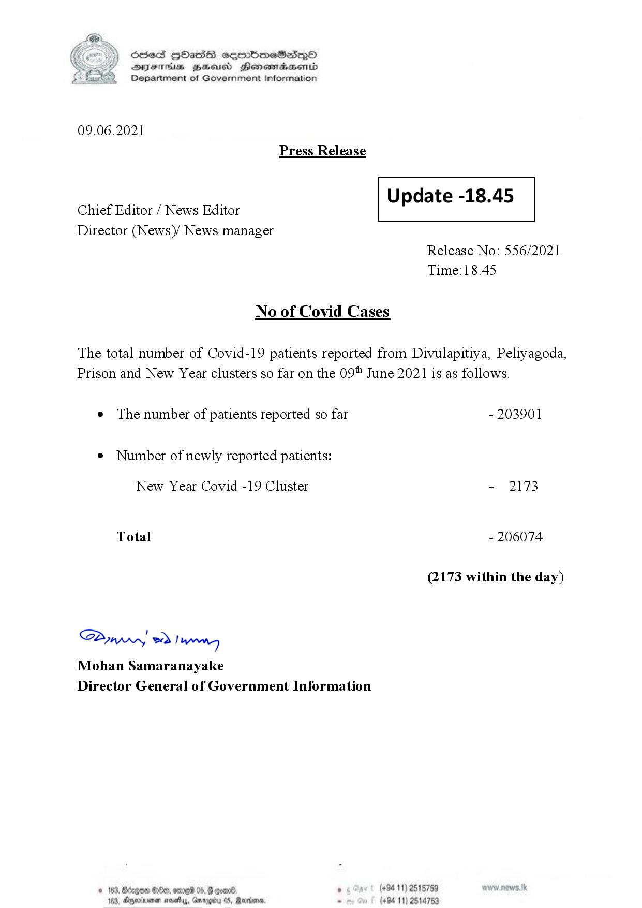

# Press Release No. 556
*2021-06-09 18:45*
## Statistics
* Total Confirmed Cases: 206074
* Total Confirmed Cases (New Year Cluster): 2173
* Total Confirmed Cases (Not New Year Cluster): 203901
* New Cases: 2173


## Appendix: Structured Information
```json
{
  "ref_no": "556",
  "unixtime": 1623264300,
  "datetime": "2021-06-09 18:45",
  "cum_conf": 206074,
  "cum_conf_new_year": 2173,
  "cum_conf_patients": 203901,
  "new_conf": 2173
}
```

## Appendix: Raw Text
```text
S) ScdeS [bad cermbmeSdQo
SVsThis gZeeicd Henssndasombd
Department of Government Information

 

09.06.2021
Press Release

an Update -18.45
Chief Editor / News Editor

Director (News)/ News manager

 

Release No: 556/2021
Time:18.45

No of Covid Cases

The total number of Covid-19 patients reported from Divulapitiya, Peliyagoda,
Prison and New Year clusters so far on the 09" June 2021 is as follows.

e The number of patients reported so far - 203901

¢ Number of newly reported patients:

New Year Covid -19 Cluster - 2173
Total - 206074
(2173 within the day)

Saw ed Iwo
Mohan Samaranayake
Director General of Government Information

© 163, Bdagen &10t9, e160 05, @ comn®. ° (+94 11) 2515789
183, Agminvmen nals, Garogty 05, @arbonn. . (+94 11) 2514753

```

## Appendix: Original Images

### Page 001


        

...

Automatically generated by https://github.com/nuuuwan/nopdf

    
    