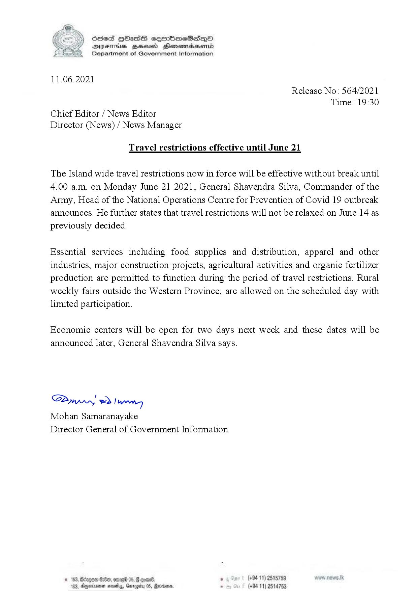

# Press Release No. 564
*2021-06-11 19:30*


Travel restrictions effective until June 21
The Island wide travel restrictions now in force will be effective without break until
4.00 a.m. on Monday June 21 2021, General Shavendra Silva, Commander of the
Army, Head of the National Operations Centre for Prevention of Covid 19 outbreak
announces. He further states that travel restrictions will not be relaxed on June 14 as
previously decided.
Essential services including food supplies and distribution, apparel and other
industries, major construction projects, agricultural activities and organic fertilizer
production are permitted to function during the period of travel restrictions. Rural
weekly fairs outside the Western Province, are allowed on the scheduled day with
limited participation.
Economic centers will be open for two days next week and these dates will be
announced later, General Shavendra Silva says.

## Appendix: Structured Information
```json
{
  "ref_no": "564",
  "unixtime": 1623439800,
  "datetime": "2021-06-11 19:30",
  "uncategorized_text_lines": [
    "Travel restrictions effective until June 21",
    "The Island wide travel restrictions now in force will be effective without break until",
    "4.00 a.m. on Monday June 21 2021, General Shavendra Silva, Commander of the",
    "Army, Head of the National Operations Centre for Prevention of Covid 19 outbreak",
    "announces. He further states that travel restrictions will not be relaxed on June 14 as",
    "previously decided.",
    "Essential services including food supplies and distribution, apparel and other",
    "industries, major construction projects, agricultural activities and organic fertilizer",
    "production are permitted to function during the period of travel restrictions. Rural",
    "weekly fairs outside the Western Province, are allowed on the scheduled day with",
    "limited participation.",
    "Economic centers will be open for two days next week and these dates will be",
    "announced later, General Shavendra Silva says."
  ]
}
```

## Appendix: Raw Text
```text
Ses HOasS seembmeSes—O
SYsThs ZaHsucd Honemadsenid
Department of Government Information

 

11.06.2021
Release No: 564/2021
Time: 19:30
Chief Editor / News Editor
Director (News) / News Manager

Travel restrictions effective until June 21

The Island wide travel restrictions now in force will be effective without break until
4.00 a.m. on Monday June 21 2021, General Shavendra Silva, Commander of the
Army, Head of the National Operations Centre for Prevention of Covid 19 outbreak
announces. He further states that travel restrictions will not be relaxed on June 14 as
previously decided.

Essential services including food supplies and distribution, apparel and other
industries, major construction projects, agricultural activities and organic fertilizer
production are permitted to function during the period of travel restrictions. Rural
weekly fairs outside the Western Province, are allowed on the scheduled day with
limited participation.

Economic centers will be open for two days next week and these dates will be
announced later, General Shavendra Silva says.

SPywwwy > Inn
Mohan Samaranayake
Director General of Government Information

° (+94 11) 2515759
(+94 11) 2514753

 

```

## Appendix: Original Images

### Page 001


        

...

Automatically generated by https://github.com/nuuuwan/nopdf

    
    