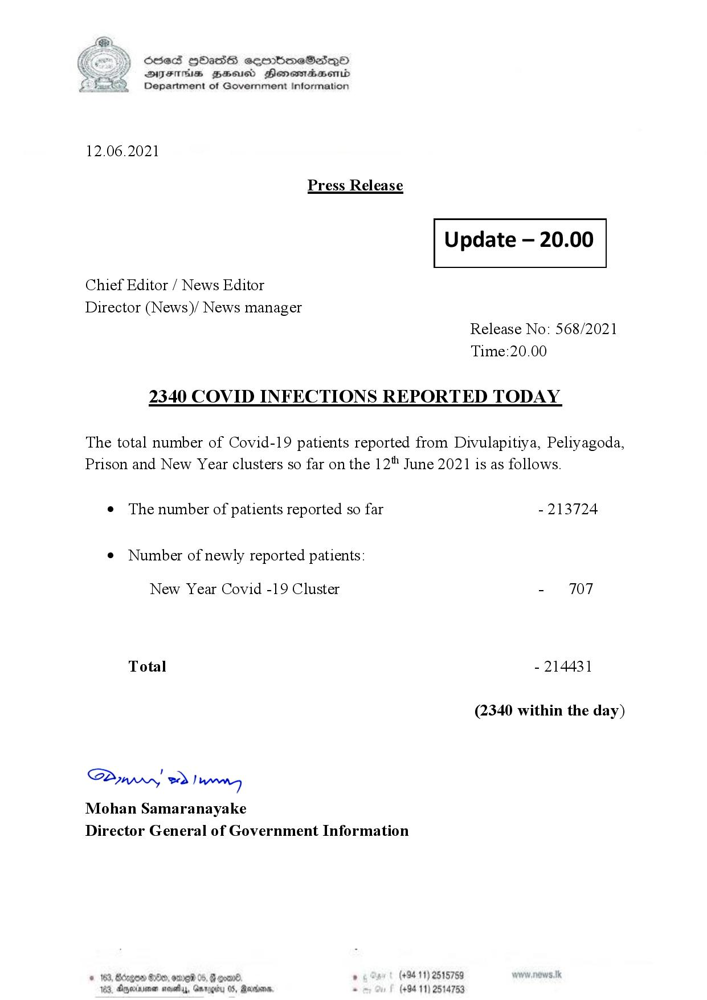

# Press Release No. 568
*2021-06-12 20:00*
## Statistics
* Total Confirmed Cases: 214431
* Total Confirmed Cases (New Year Cluster): 707
* Total Confirmed Cases (Not New Year Cluster): 213724
* New Cases: 2340


## Appendix: Structured Information
```json
{
  "ref_no": "568",
  "unixtime": 1623528000,
  "datetime": "2021-06-12 20:00",
  "cum_conf": 214431,
  "cum_conf_new_year": 707,
  "cum_conf_patients": 213724,
  "new_conf": 2340
}
```

## Appendix: Raw Text
```text
S) ScdeS [bad cermbmeSdQo
DFTs BHEoisd Henewtaeaserid
Department of Government Information

 

12.06.2021

Press Release

Update

 

Chief Editor / News Editor

Director (News)/ News manager
Release No: 568/2021
Time:20.00

2340 COVID INFECTIONS REPORTED TODAY

The total number of Covid-19 patients reported from Divulapitiya, Peliyagoda,
Prison and New Year clusters so far on the 12" June 2021 is as follows.

e The number of patients reported so far - 213724

¢ Number of newly reported patients:

New Year Covid -19 Cluster - 707
Total - 214431
(2340 within the day)

Sw 2) wn
Mohan Samaranayake
Director General of Government Information

© 163, Bdrgon Ge, ome 05, G goad . (+94 11) 2515759
163, Dnexnonen novels, Gmrogrty 05, Rarans . (+94 11) 2514753

```

## Appendix: Original Images

### Page 001


        

...

Automatically generated by https://github.com/nuuuwan/nopdf

    
    